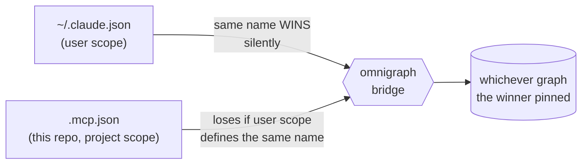

# Claude Code Instructions

**Read [AGENTS.md](AGENTS.md) first** — skills, memory model, env vars, hard rules.
This file is *only* the Claude-specific delta. Start at the router:
`skills/repository-index/SKILL.md`.

## MCP config precedence — the trap



A same-named user-scope server **silently overrides** this repo's `.mcp.json`. Nothing
errors — the bridge answers, just about the wrong graph. On 2026-07-17 one pinned to
`graph_id: memory` hid every repo's graph; an agent read `memory`'s 2 Preferences, concluded
`basic-analysis` (135 nodes, intact) was **wiped**, and started rebuilding it.

```bash
python -c "import json,pathlib;print(sorted((json.loads((pathlib.Path.home()/'.claude.json').read_text()).get('mcpServers') or {})))"
# must NOT list `omnigraph` — this repo's .mcp.json provides it
```

## Failure modes — all silent

| Symptom | Cause | Fix |
|---|---|---|
| wrong/empty graph, `0 rows except 2 Preferences` | user-scope override | remove it (above) |
| `missing bearer token` | `OMNIGRAPH_TOKEN` unset | export it |
| `fetch failed` | wrong `OMNIGRAPH_NET` (a network can **exist but be empty**) | probe `scripts/_omni_env.py` |
| `pull access denied for omnigraph-mcp` | image not built (on no registry) | `docker build -t omnigraph-mcp:latest infra/mcp-servers/servers/omnigraph-mcp` |

All four: `infra/mcp-servers/omnigraph-setup/setup-agent-memory.ps1 -Check` (or `.sh --check`).

## Notes

- **This repo uses its own `.mcp.json`** → `agent-skills` graph.
  `infra/mcp-servers/config/mcp-claude-code.json` is a *template*, not what this repo uses.
- **Restart to load MCP servers** — they initialize only at session start; Claude Code
  prompts once to approve a project's `.mcp.json`.
- **Bridge transport:** `docker` here (node/npx absent on `coding.vm`; needs the image built
  per host). Hosts *with* Node may use the `npx` bridge (as `basic-analysis`/`Invest` do) —
  no image, no `OMNIGRAPH_NET`, reaches `localhost` instead of a container DNS alias.
- Updating a starter: keep its entrypoints aligned with `skills/` and the full `SKILL.md`.
