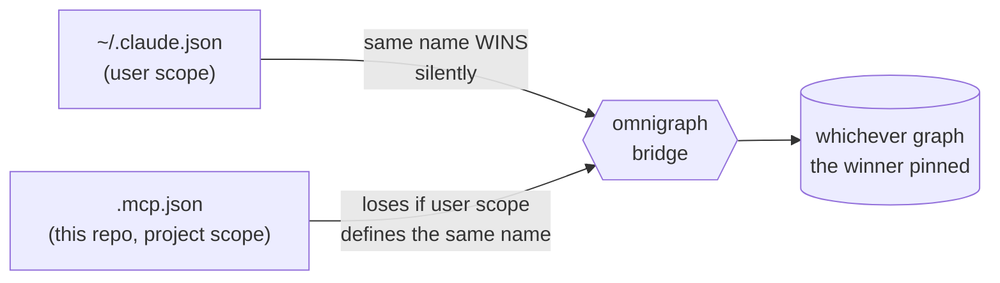

# Claude Code Instructions

**Read [AGENTS.md](AGENTS.md) first** — skills, memory model, env vars, hard rules.
This file is *only* the Claude-specific delta. Start at the router:
`skills/repository-index/SKILL.md`.

## MCP config precedence — the trap (omnigraph), and what it is *not* (serena)


```mermaid
flowchart LR
    U["~/.claude.json<br/>(user scope)"] -- "same name WINS<br/>silently" --> B{{"omnigraph<br/>bridge"}}
    P[".mcp.json<br/>(this repo, project scope)"] -- "loses if user scope<br/>defines the same name" --> B
    B --> G[("whichever graph<br/>the winner pinned")]
```

**Measured for `omnigraph`, and stated only for `omnigraph`.** A same-named user-scope
omnigraph server silently overrides this repo's `.mcp.json`. Nothing errors — the bridge
answers, just about the wrong graph. On 2026-07-17 one pinned to `graph_id: memory` hid every
repo's graph; an agent read `memory`'s 2 Preferences, concluded `basic-analysis` (135 nodes,
intact) was **wiped**, and started rebuilding it.

> **Do not generalise this — it does not hold for `serena`.** This claim used to be written as
> a general rule about any same-named server, and that made a duplicate serena entry look
> harmless. Measured in `gen-analysis` on 2026-09-01, a duplicate serena definition produced
> **no winner at all**: both ran, as five separate processes — one carrying `--context
> claude-code` (user scope) and four without it (project scope, one per open session) — and the
> session's `mcp__serena__*` calls landed on a **project-scope** one, reporting `Active context:
> desktop-app` and a one-project roster where the real home registers eleven. For a stdio
> server a duplicate is a duplicate *process*, not a shadowed definition, and which one answers
> is not something to rely on. The safe rule is identical either way: **never define the same
> server in both scopes.** Serena belongs in user scope only, for the same reason graphify does
> — `skills/mcp-servers-setup/SKILL.md` → Serena → *Wiring*.

```bash
python -c "import json,pathlib;print(sorted((json.loads((pathlib.Path.home()/'.claude.json').read_text()).get('mcpServers') or {})))"
# must NOT list `omnigraph` — this repo's .mcp.json provides it
```

That check is negative — it proves nothing is *shadowing*. The positive check asks the graph
who it thinks it is, and is one query:

```gq
query whoami() { match { $p: Project } return { $p.slug, $p.repository } }
```

`repository` must equal this repo's `git remote get-url origin`
(`https://github.com/Ch3fUlrich/agent-skills.git`). If it does not, the bridge is serving
another repository's graph and every recall is about a different codebase. Before that
property existed (2026-08-31) the wrong graph and a wiped graph were indistinguishable,
which is exactly how the 2026-07-17 incident above escalated into a rebuild. Names come from
`graphs_list`; `cluster.yaml` is gitignored and purged from history, so it is **not** a
discovery source. Protocol: `skills/structured-memory/SKILL.md`.

`graphify` is the deliberate **exception**: it *should* appear in user scope, as the single
cwd-relative entry (workstation `uv` / server `graphify-mcp` wrapper) that serves whichever
repo you launch from. It takes **no** per-repo entry, so it has nothing to be shadowed by —
don't "fix" it out of user scope. See `skills/mcp-servers-setup/SKILL.md` → Graphify.

## Failure modes — all silent

| Symptom | Cause | Fix |
|---|---|---|
| wrong/empty graph, `0 rows except 2 Preferences` | user-scope override | confirm with `whoami` (above), then remove it |
| MCP tool **absent entirely** — no prompt, no error | project server in `.mcp.json` never **approved** | add it to `.claude/settings.local.json` → `enabledMcpjsonServers` (a tracked `.mcp.json` cannot approve itself) |
| graph answers describe **another repo** | launched from the wrong cwd, or a stray project/hardcoded `graphify` entry shadows the single user-scope one | `bash infra/mcp-servers/scripts/linux/check-graphify-scope.sh --fix` |
| graphify `Failed to connect — Connection closed` | `graphify-mcp:latest` not built, or its `mcp` dep resolved to 2.x (dropped `mcp.types.AnyUrl`) | `docker build -t graphify-mcp:latest infra/mcp-servers/servers/graphify-mcp` (Dockerfile pins `mcp<2`) |
| `missing bearer token` | `OMNIGRAPH_TOKEN` unset | export it |
| `fetch failed` | wrong `OMNIGRAPH_NET` (a network can **exist but be empty**) | probe `scripts/_omni_env.py` |
| `pull access denied for omnigraph-mcp` | image not built (on no registry) | `docker build -t omnigraph-mcp:latest infra/mcp-servers/servers/omnigraph-mcp` |

All four: `infra/mcp-servers/omnigraph-setup/setup-agent-memory.ps1 -Check` (or `.sh --check`).

## Notes

- **This repo uses its own `.mcp.json`** → `agent-skills` graph.
  `infra/mcp-servers/config/mcp-claude-code.json` is a *template*, not what this repo uses.
- **Restart to load MCP servers** — they initialize only at session start; Claude Code
  prompts once to approve a project's `.mcp.json`.
- **Bridge transport:** `docker` here (node/npx absent on `coding.vm`; needs the image built
  per host). Hosts *with* Node may use the `npx` bridge (as `basic-analysis`/`Invest` do) —
  no image, no `OMNIGRAPH_NET`, reaches `localhost` instead of a container DNS alias.
- Updating a starter: keep its entrypoints aligned with `skills/` and the full `SKILL.md`.
