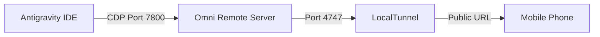

# Antigravity Remote UI Guide

This guide explains how to stream the Antigravity IDE UI to your phone so you can have a "Claude Code CLI remote session"-like experience on mobile.

## How it works

Since Antigravity is an advanced desktop agentic IDE, it doesn't natively expose a mobile app. However, by leveraging **Chrome DevTools Protocol (CDP)**, we can connect a remote chat monitor directly to the Antigravity session.

We use the open-source tool **`omni-antigravity-remote-chat`**. This tool connects to the Antigravity session, captures the Chat DOM in real-time, and provides a premium, responsive mobile UI on a local web server (running on port `4747`).

To make this web server accessible from your phone over the Internet (e.g., when you are away from your workstation), we use **LocalTunnel**, which safely exposes your local port `4747` to a public `https://...loca.lt` URL.

## Fully Automated Setup

We have bundled an intelligent setup script (`start-remote-session.ps1`) to handle everything automatically:
1. **Node.js Installation**: If Node is not installed, the script will automatically download and install it in the background using `winget` or Microsoft Installer.
2. **Debugger Port Injection**: Antigravity must run with the `--remote-debugging-port=7800` flag. The script dynamically detects your Antigravity installation and process. If the debugger is not attached, it will ask for your permission to automatically restart the IDE with the correct flags injected.
3. **Tunneling**: It simultaneously spins up both the UI server and the internet tunnel in new windows.

## Architecture

## Security

* The remote session will display the exact UI of your current Antigravity window.
* LocalTunnel creates a temporary, randomly generated URL. Do not share this URL with anyone.
* The session will only stay alive as long as your computer is on and the scripts are running.
