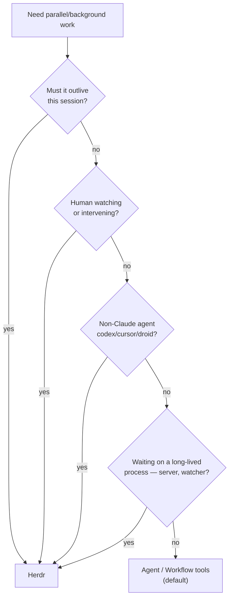

# Herdr Orchestration

Herdr is the agent multiplexer adopted in [ADR 0002](../../docs/decisions/0002-herdr-multiplexer.md);
install and remote-access setup live in
[`infra/remote-access/herdr/README.md`](../../infra/remote-access/herdr/README.md). This skill
covers only the part an **agent** needs: driving the socket API from inside a pane.

## 0. Guardrail — check before every herdr call

```bash
[ "$HERDR_ENV" = "1" ] || { echo "not inside a Herdr pane — stop"; exit 1; }
```

Without `HERDR_ENV=1` you are not in a Herdr-managed pane and must not drive someone else's
session. When set, you also get `HERDR_PANE_ID`, `HERDR_TAB_ID`, `HERDR_WORKSPACE_ID`,
`HERDR_SOCKET_PATH` — that is *your own* pane, so never close or write to it.

## 1. Use native orchestration first — this is the default

Claude Code's `Agent` and `Workflow` tools return **typed objects**; Herdr returns **scraped
terminal text**. Anything that starts and finishes inside one conversation — `qa-swarm`
fan-out, `swarm-orchestration` roles, parallel search — belongs to the native tools. Reaching
for Herdr there trades schemas, automatic result plumbing, resume, and budget accounting for a
screen-scraper. That trade is always bad.



Herdr earns its place on exactly four things the native tools **cannot** do:

| Capability | Why native can't |
|---|---|
| **Survives session death** | Panes outlive Claude Code exiting, SSH dropping, the lid closing. Subagents die with the session. |
| **Non-Claude agents** | `herdr integration install` covers codex, cursor, copilot, droid, opencode, devin, kimi… `Agent` spawns only Claude. Real cross-*model* diversity for adversarial review. |
| **Human-in-the-loop** | Attach over SSH (incl. phone), watch live, `agent attach --takeover` to intervene. Subagents are invisible until they return. |
| **Long-lived process sync** | `wait output` on a dev server's readiness line. |

Best pattern is **both**: park the server or the overnight job in a pane, orchestrate natively
against it.

## 2. Command surface (verified on 0.7.4)

| Goal | Command |
|---|---|
| List peers + status | `herdr agent list` |
| Spawn | `herdr agent start <name> --cwd PATH --no-focus -- <argv...>` |
| Read output | `herdr agent read <target> --source visible --lines N` |
| Block on output | `herdr wait output <pane> --match TEXT --source visible --timeout MS` |
| Block on status | `herdr agent wait <target> --status idle\|working\|blocked --timeout MS` |
| Send text | `herdr agent send <target> <text>` · Enter: `herdr pane send-keys <pane> Enter` |
| Isolate | `herdr worktree create --branch NAME --base REF` |
| Tear down | `herdr pane close <pane_id>` |

All emit JSON on stdout. Targets accept terminal ids, unique agent names, or pane ids.
`herdr api schema` dumps the full API; `herdr api snapshot` dumps live state.

## 3. Gotchas — each one fails silently

| Trap | Consequence | Do this |
|---|---|---|
| **`--source recent` returns `""`** | A verified spawn looks like it produced nothing; polling loops spin to timeout. | Use `--source visible`. |
| **Status is heuristic unless the hook is installed** | `agent wait --status idle` can fire while a model is *thinking* — a race, not a wait. Herdr detects agents and shows `working`/`idle` **either way**, so it looks correct. | `herdr integration install claude` (writes `~/.claude/hooks/herdr-agent-state.sh`). Confirm with `herdr integration status` — must not say `not installed`. |
| **`agent send` writes literal text, no Enter** | Prompt sits in the input box forever. | Follow with `pane send-keys <pane> Enter`. |
| **Interactive TUIs redraw** | Reads capture spinners and box-art, not answers. | Prefer `claude -p '…'` (non-interactive) for anything you intend to parse; reserve interactive panes for humans. |
| **Panes share the working tree** | Parallel agents corrupt each other's edits. | `herdr worktree create` per agent. |
| **Spawned agents are cold + unmetered** | No inherited context; each burns its own quota with no `budget.spent()` visibility. | Brief via a file; keep the fleet small and deliberate. |

**Always close what you spawn** (`pane close`) — orphaned panes outlive the session by design,
which is the whole point and also the whole risk.

## 4. Verified loop

```bash
[ "$HERDR_ENV" = "1" ] || exit 1
P=$(herdr agent start probe --cwd /tmp --no-focus -- \
      bash -c 'claude -p "Reply with exactly: OK"; sleep 60' \
    | python3 -c 'import sys,json;print(json.load(sys.stdin)["result"]["agent"]["pane_id"])')
herdr wait output "$P" --match OK --source visible --timeout 90000
herdr pane close "$P"
```

Spawn → run → block → teardown, confirmed end-to-end on 2026-07-19.
