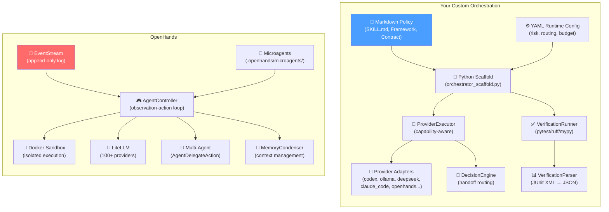
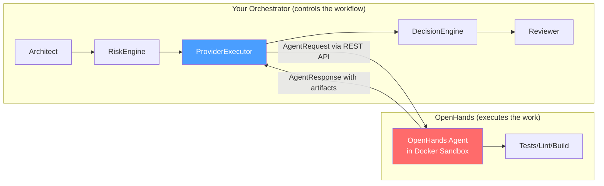

# Custom Orchestration vs OpenHands: Deep Analysis

## Executive Summary

Your custom orchestration and OpenHands solve **overlapping but different problems**.
OpenHands is a production-grade *single-agent execution engine* with strong sandboxing, tool use, and LLM abstraction.
Your custom orchestration is a *multi-agent coordination framework* with contract-first handoffs, risk-gated routing, and policy-driven verification.

**Neither fully replaces the other.** The highest-value path is to use OpenHands as one of your provider adapters — specifically, to replace the stubbed `openhands.py` with a live adapter that delegates *engineer-role execution* to an OpenHands agent running inside a Docker sandbox, while your orchestrator retains control over risk routing, contract enforcement, verification evidence injection, and handoff decisions.

---

## Architecture Comparison



---

## Dimension-by-Dimension Comparison

### 1. Multi-Agent Coordination

| Aspect | Custom Orchestration | OpenHands |
|---|---|---|
| **Model** | 3-role hierarchy (Architect→Engineer→Reviewer) with explicit contracts | Flat delegation via `AgentDelegateAction` |
| **Handoff mechanism** | Contract-first: `ARCHITECTURE_CONTRACT.md` with SHA-256 hash for drift detection | Event-passing: sub-agent receives a prompt, returns a summary |
| **Risk-gated routing** | ✅ 11-signal risk engine → selects single/Best-of-3/Best-of-5 | ❌ No risk awareness; agent decides when to delegate |
| **Verification injection** | ✅ Structured JUnit/lint evidence injected into Reviewer context | ❌ Agent runs tests itself inside sandbox (no structured parsing) |
| **Decision engine** | ✅ Policy-driven 5-outcome routing (continue/escalate/block/fail/human_review) | ❌ Agent decides next step via LLM reasoning |
| **Concurrency** | ❌ Synchronous only (Best-of-N is computed but not executed in parallel) | ❌ Blocking delegation (parent waits for sub-agent) |

> [!IMPORTANT]
> **Your orchestration's contract-first handoff model is genuinely novel.** OpenHands has no equivalent. When an OpenHands agent delegates to a sub-agent, it passes a natural-language prompt — there's no machine-checkable contract, no hash-based drift detection, no forbidden-change enforcement. Your system's `ARCHITECTURE_CONTRACT.md` with scoped interfaces, invariants, and resume instructions prevents the #1 multi-agent failure: vague delegation.

### 2. Execution Sandbox & Code Isolation

| Aspect | Custom Orchestration | OpenHands |
|---|---|---|
| **Isolation model** | Git worktrees (filesystem-level branches) | Docker containers (full OS-level isolation) |
| **Security** | `subprocess.run(shell=False)` hardening | Container boundary + `SecurityAnalyzer` + `ConfirmationPolicy` |
| **File collision prevention** | Lock files with TTL + owner-checked release | Container isolation (each agent gets own filesystem) |
| **Network isolation** | ❌ None | ✅ Configurable container networking |
| **Arbitrary code execution** | ⚠️ Runs in host process | ✅ Contained inside Docker |

> [!WARNING]
> **OpenHands wins decisively on sandboxing.** Your orchestration runs `pytest`, `ruff`, and `mypy` as subprocess calls *on the host machine*. An engineer agent that writes malicious code could compromise the host. OpenHands runs everything inside a Docker container by default. This is a fundamental safety gap in your current setup.

### 3. LLM Provider Abstraction

| Aspect | Custom Orchestration | OpenHands |
|---|---|---|
| **Provider count** | 7 adapters (4 live: codex, deepseek, ollama, local_glm; 3 stubbed) | 100+ via LiteLLM |
| **Capability detection** | ✅ Explicit `capabilities()` per adapter → strategy negotiation | ❌ Assumes all models speak the same protocol |
| **Payload shaping** | ✅ Dynamic: `strict_schema` > `json_mode` > `prompt_fallback` > `plain_text` | ❌ Single prompt format for all models |
| **Mixed-provider runs** | ✅ Architect on Claude, Engineer on GPT, Reviewer on DeepSeek | ✅ Configurable per agent instance |
| **Fallback chains** | ✅ 3-deep per role in YAML | ❌ Single model per agent |

> [!TIP]
> **Your capability-aware payload shaping is a genuine innovation.** OpenHands doesn't distinguish between a model that can enforce JSON schemas natively and one that needs prompt coercion. Your `ProviderExecutor._determine_response_strategy()` handles this cleanly. This logic could be ported into OpenHands as a middleware layer.

### 4. Verification & Testing

| Aspect | Custom Orchestration | OpenHands |
|---|---|---|
| **Test execution** | Dedicated `VerificationRunner` (pytest/ruff/mypy) | Agent runs tests itself inside sandbox |
| **Output parsing** | ✅ JUnit XML → structured JSON bundle with failing test details | ❌ Agent reads raw terminal output |
| **Evidence injection** | ✅ Structured bundle passed to Reviewer as machine-readable metadata | ❌ Agent self-evaluates test results |
| **Independent verification** | ✅ Reviewer is a separate agent with different model family | ❌ Same agent that wrote the code evaluates it |
| **Extensibility** | ❌ Hardcoded to 3 Python tools | ✅ Agent can run any command in sandbox |

> [!NOTE]
> Your verification pipeline produces *structured, machine-readable evidence* that a separate Reviewer agent evaluates. This is architecturally superior to OpenHands's "agent reads its own test output" model, because it separates the writer from the evaluator. However, OpenHands can run *any* verification command (not just pytest/ruff/mypy) because the agent has full sandbox access.

### 5. Checkpointing & Recovery

| Aspect | Custom Orchestration | OpenHands |
|---|---|---|
| **Mechanism** | JSON checkpoint files in `.agent-state/checkpoints/` | Event-sourced: replay append-only event log |
| **Contract drift detection** | ✅ SHA-256 hash comparison on resume | ❌ No equivalent |
| **Recovery** | Read checkpoint → recreate worktree if missing → resume | Replay events → find unmatched action → re-execute |
| **Time-travel debugging** | ❌ Single latest checkpoint | ✅ Full event replay to any point |
| **Cross-session persistence** | ✅ Durable JSON files | ✅ Durable event files |

### 6. Customization & Extension

| Aspect | Custom Orchestration | OpenHands |
|---|---|---|
| **Policy configuration** | Rich YAML with 15+ sections | `.openhands_instructions` + microagent YAML |
| **Per-repo customization** | ❌ Skill-level only | ✅ `.openhands/microagents/` directory |
| **Risk/budget tuning** | ✅ 11 risk weights, 3 budget thresholds, all in YAML | ❌ Not applicable |
| **Role permissions** | ✅ Per-role: can_write_code, allowed_mcps, default_skills | ❌ All agents have same permissions |
| **Enterprise features** | ❌ Build your own | ✅ SSO, RBAC, audit logs, cost dashboards |

---

## What's Genuinely Better in Each System

### Your Custom Orchestration Wins On:
1. **Contract-first handoffs** — machine-checkable architecture contracts with hash-based drift detection
2. **Risk-gated routing** — 11-signal risk engine that determines orchestration intensity
3. **Capability-aware payload shaping** — dynamic negotiation between provider capabilities and request format
4. **Structured verification evidence** — JUnit XML parsing into machine-readable JSON for independent review
5. **Policy-driven decision routing** — 5-outcome handoff engine with configurable policy knobs
6. **Explicit role separation** — Architect/Engineer/Reviewer with different models to reduce shared blind spots
7. **Token budget supervision** — advisory (not hard-cut) budget with architect intervention triggers

### OpenHands Wins On:
1. **Docker sandbox** — real OS-level isolation vs. running on the host
2. **Event-sourced state** — time-travel debugging, crash recovery via event replay
3. **LLM abstraction breadth** — 100+ providers via LiteLLM vs. 4 live adapters
4. **Execution flexibility** — agent can run *any* command, not just 3 hardcoded verifiers
5. **Memory condensation** — automatic context window management for long tasks
6. **Enterprise features** — SSO, RBAC, audit logs out of the box
7. **Community & ecosystem** — active open-source development, SWE-bench benchmarking
8. **Production readiness** — battle-tested on real engineering tasks

---

## Can You Integrate Them?

**Yes.** There are three viable integration strategies, from lightest to deepest:

### Strategy A: OpenHands as a Provider Adapter (Recommended)



**How it works:**
- Your orchestrator keeps full control: risk routing, contract enforcement, verification evidence, handoff decisions
- The `openhands.py` adapter is implemented to call the OpenHands REST API (`/api/conversations`) or SDK
- OpenHands handles the *execution* inside a Docker sandbox: file editing, terminal commands, browser actions
- Your `VerificationRunner` can optionally run *inside* the OpenHands sandbox via a delegated command
- The adapter extracts the agent's response, file changes, and test results back into your `AgentResponse` format

**What you gain:**
- Docker-level isolation for engineer execution (biggest safety upgrade)
- Agent can use terminal, browser, file editing tools natively
- Access to 100+ LLMs via LiteLLM (but your capability shaping logic would need to adapt)
- Memory condensation for long tasks

**What you preserve:**
- Contract-first handoffs (OpenHands just executes; your orchestrator validates the contract)
- Risk-gated routing (your RiskEngine decides; OpenHands doesn't know about it)
- Structured verification injection (your parser/decision engine still evaluates evidence)
- Role separation (Architect and Reviewer never touch OpenHands)

**Implementation sketch:**
```python
# In providers/openhands.py
def invoke(self, request: AgentRequest) -> AgentResponse:
    # 1. Start an OpenHands conversation via REST API
    conversation = self._create_conversation(
        task=request.user_prompt,
        system_prompt=request.system_prompt,
        model=request.model,
        workspace_dir=request.working_directory,
    )
    # 2. Wait for completion (poll or websocket)
    result = self._wait_for_completion(conversation.id)
    # 3. Extract structured response
    return AgentResponse(
        agent_id=request.agent_id,
        role=request.role,
        status="success" if result.exit_ok else "failed",
        content=result.final_message,
        files_touched=result.modified_files,
        raw=result.events,
    )
```

### Strategy B: Microagents for Contract Enforcement

**How it works:**
- You create OpenHands microagents (`.openhands/microagents/`) that embed your contract-first workflow
- A `contract-engineer.yaml` microagent triggers on task keywords and instructs the agent to read `ARCHITECTURE_CONTRACT.md`, respect forbidden changes, run verification commands, and output structured results
- Your orchestrator scripts become the *outer loop* that creates the contract, launches OpenHands, and validates the output

**Limitation:** Microagents are prompt-based, not code-enforced. The agent might ignore contract constraints if the LLM hallucinates or gets confused. Your current system enforces contracts via code (hash checking, lock files, scope validation).

### Strategy C: Fork OpenHands and Inject Your Logic

**How it works:**
- Fork the OpenHands repo
- Inject your `DecisionEngine`, `VerificationParser`, and `RiskEngine` as custom tools or controller middleware
- Replace the default `AgentController` loop with your contract-aware orchestration loop
- Use OpenHands's sandbox infrastructure but your routing/verification logic

**Risk:** Heavy maintenance burden. Every OpenHands upstream update could conflict with your customizations.

---

## Recommendation

> [!IMPORTANT]
> **Go with Strategy A: OpenHands as a Provider Adapter.**

It gives you the best of both worlds:
- Your orchestrator's *unique strengths* (contracts, risk routing, structured verification, decision engine) stay intact
- OpenHands's *unique strengths* (Docker sandbox, LiteLLM, memory condensation, execution flexibility) are absorbed as an execution backend
- The integration surface is narrow (one adapter file) and maintenance-light

### Concrete Next Steps

| Priority | Task | Effort |
|---|---|---|
| 🔴 P0 | Implement live `openhands.py` adapter using OpenHands REST API | ~2 days |
| 🔴 P0 | Run OpenHands in Docker alongside your orchestrator | ~1 day |
| 🟡 P1 | Create a microagent that injects contract-awareness into OpenHands execution | ~0.5 day |
| 🟡 P1 | Extend `VerificationRunner` to execute inside OpenHands sandbox | ~1 day |
| 🟢 P2 | Port capability-aware payload shaping to OpenHands as a LiteLLM middleware | ~2 days |
| 🟢 P2 | Implement Best-of-N parallel execution using multiple OpenHands containers | ~3 days |

---

## What NOT to Port to OpenHands

These components are **better kept in your orchestrator** because OpenHands doesn't have equivalent abstractions:

1. **RiskEngine** — OpenHands has no concept of risk-gated execution intensity
2. **DecisionEngine** — OpenHands agents self-evaluate; your independent evidence-based routing is superior
3. **Contract hashing** — OpenHands has no contract drift detection
4. **Role separation** — OpenHands agents are generic; your Architect/Engineer/Reviewer split is enforced by code
5. **YAML policy layer** — OpenHands uses `.openhands_instructions` (one flat file) vs. your 15-section structured config

## What TO Port to OpenHands (via microagents or middleware)

1. **Verification evidence format** — Teach OpenHands agents to output JUnit-compatible results so your parser can consume them
2. **Contract-awareness prompts** — Microagents that instruct the agent to read and respect `ARCHITECTURE_CONTRACT.md`
3. **Structured output format** — Microagents that tell the agent to output JSON in a specific schema for your parser
