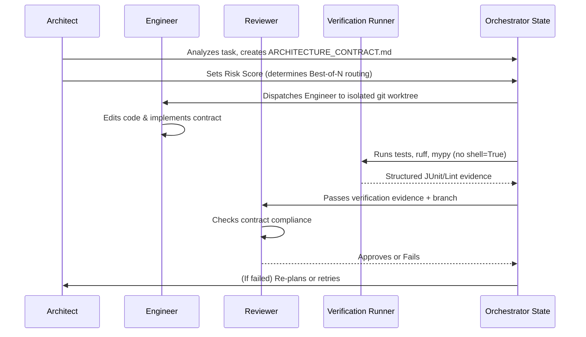

# Swarm Orchestration Scaffold

This repository provides a capability-aware, provider-agnostic agent orchestration system. It uses Markdown for canonical policy, YAML for declarative runtime configuration, and Python for the local execution scaffold.

## Core Flow

The system orchestrates a swarm of agents (Architect, Engineer, Reviewer) around a central `ARCHITECTURE_CONTRACT.md`. The workflow ensures architectural intent survives implementation.



## Architectural Principles

1. **Markdown Remains Canonical**
   - Documents like `SKILL.md`, `ARCHITECTURE_CONTRACT_template.md`, `AGENT_ORCHESTRATION_FRAMEWORK.md`, and `AGENT_ORCHESTRATION_RATIONALE.md` define the system's core rules and constraints. Agents must read these first.
2. **YAML is Declarative Runtime Policy**
   - `custom_orchestration/agent_orchestration.config.yaml` dictates runtime routing, risk thresholds, MCP assignments, and provider failover logic. It explicitly separates operational thresholds from Python execution logic.
3. **Python is Execution Support (`custom_orchestration/`)**
   - The Python implementation coordinates checkpointing, lock management, verification execution, and structured payload parsing. It strictly enforces Markdown rules but does not define new policy.
4. **Provider-Specific Logic is Isolated**
   - The `custom_orchestration/providers/` package contains individual provider adapters (e.g., `codex.py`, `ollama.py`, `claude_code.py`). This prevents the core orchestrator from getting tangled up in provider-specific request formats or capability differences.

## Provider Capabilities and Response Strategies

The system uses a capability-aware matrix to decouple orchestration intent from underlying provider mechanics.

### Capability Detection
Each provider adapter explicitly declares its supported capabilities via the `capabilities()` method:
- `structured_output`: Can natively return structured data.
- `strict_schema`: Can strictly enforce JSON schemas (e.g., OpenAI Structured Outputs).
- `tool_calling`: Supports tool/function calling APIs.
- `json_mode`: Can guarantee valid JSON without strict schema adherence.
- `prompt_json_fallback`: Capable of following a prompt instruction to output JSON if native modes fail.
- `plain_text`: Can return standard markdown/text.

### Payload Shaping
The `ProviderExecutor` selects an optimal **Response Strategy** dynamically based on the requested tool/schema constraints and the provider's capabilities:
1. **Tool Calling**: When tools are provided, invokes native function-calling formats.
2. **Strict Schema**: When a schema is provided and supported, enforces rigid validation.
3. **JSON Mode**: Fallback for structured data without strict schemas.
4. **Prompt Fallback**: Appends explicit formatting instructions to the system prompt if native structured formats aren't available.

## Core Mechanics

- **Decision Engine**: Normalizes provider outputs (plain text, JSON, tool calls) into safe execution pathways (escalation, handoffs, blockages).
- **Verification Runner & Parser**: Safely executes local tools (`pytest`, `ruff`, `mypy`) without `shell=True` and translates outputs (e.g., JUnit XML) into a structured bundle for the Reviewer.
- **Git State Manager**: Uses `git worktree` for isolated multi-agent execution, incorporating strict lifecycle locks and stale state cleanup.

## Running the Example Scripts

A minimal runnable example script is provided in `custom_orchestration/examples/run_orchestrator.py`. This simulates an end-to-end task (creating a contract, assigning an engineer, writing a checkpoint, and doing a review pass).

### Stub Mode (Default)
Runs entirely locally using deterministic mocked payloads. No network requests are made.
```bash
python custom_orchestration/examples/run_orchestrator.py --mode stub
```

### Live Mode
Runs real API requests for supported providers:
- `codex` (OpenAI API)
- `deepseek_tui` (DeepSeek API)
- `local_glm` (Zhipu GLM API)
- `ollama` (Local Ollama API)

**Setup:**
1. Copy `custom_orchestration/agent_keys.yaml.example` to `custom_orchestration/agent_keys.yaml`.
2. Fill in the required API keys or base URLs.
3. Run the orchestrator:
```bash
# Example running deepseek
python custom_orchestration/examples/run_orchestrator.py --mode live --force-provider deepseek_tui

# Example running local ollama (auto-detects if running)
python custom_orchestration/examples/run_orchestrator.py --mode live --force-provider ollama
```

## How to Add a New Provider Adapter

1. Create a new file in `custom_orchestration/providers/` (e.g., `my_provider.py`).
2. Implement an adapter extending `ProviderAdapter` with explicit feature flags defined in `capabilities()`.
3. Support strategy-aware request shaping in `build_request()`.
4. Import your adapter in `custom_orchestration/providers/registry.py` and register it.
5. Update `custom_orchestration/agent_orchestration.config.yaml` to route roles to your new provider.
