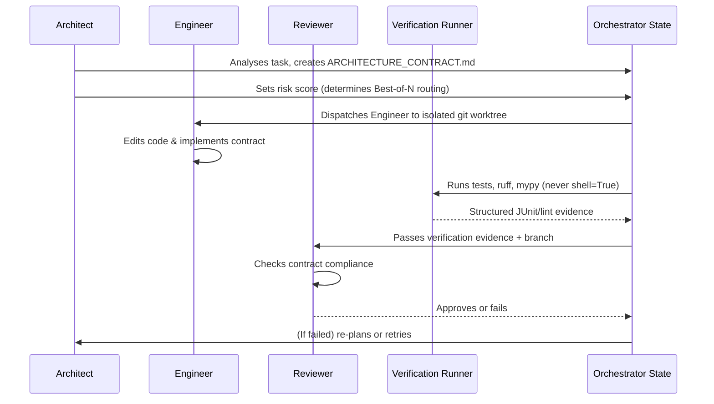

# Swarm Orchestration — running the scaffold

**This file is operational only: how to run the Python scaffold and how to extend it.** For policy
read [`SKILL.md`](SKILL.md); for the reasoning behind the design read
[`AGENT_ORCHESTRATION_RATIONALE.md`](AGENT_ORCHESTRATION_RATIONALE.md); for every threshold and
tier read [`custom_orchestration/agent_orchestration.config.yaml`](custom_orchestration/agent_orchestration.config.yaml).
Nothing here restates a rule from those files.

## What the scaffold is for

Markdown is canonical policy, YAML is declarative runtime configuration, and Python operationalises
both — it enforces the rules and defines none of its own. The swarm coordinates around a central
`ARCHITECTURE_CONTRACT.md` so architectural intent survives implementation.


```mermaid
sequenceDiagram
    participant A as Architect
    participant E as Engineer
    participant R as Reviewer
    participant V as Verification Runner
    participant O as Orchestrator State

    A->>O: Analyses task, creates ARCHITECTURE_CONTRACT.md
    A->>O: Sets risk score (determines Best-of-N routing)
    O->>E: Dispatches Engineer to isolated git worktree
    E->>E: Edits code & implements contract
    O->>V: Runs tests, ruff, mypy (never shell=True)
    V-->>O: Structured JUnit/lint evidence
    O->>R: Passes verification evidence + branch
    R->>R: Checks contract compliance
    R-->>O: Approves or fails
    O->>A: (If failed) re-plans or retries
```

Orchestrator state lives on the filesystem (`.agent-state/`). Cross-agent and long-term memory lives
**exclusively** in the `omnigraph` MCP server, never in chat history.

> **Status:** the scaffold has been exercised in stub/mock mode only. It carries known defects
> recorded in [the design spec](../../docs/superpowers/specs/2026-07-30-orchestration-context-and-economics-design.md)
> — most importantly, swarm review currently fails **open**. Read that spec's defect table before
> relying on a live run.

## Provider capabilities and payload shaping

Adapters decouple orchestration intent from provider mechanics. Each declares what it supports via
`capabilities()`: `structured_output`, `strict_schema`, `tool_calling`, `json_mode`,
`prompt_json_fallback`, `plain_text`.

`ProviderExecutor` then picks a response strategy in this order — tool calling when tools are
supplied and supported, then strict schema, then JSON mode, then prompt-appended formatting
instructions. The point is that a model which can natively enforce a schema is not handed the same
prompt as one that must be coerced into JSON.

## Core mechanics

- **DecisionEngine** — normalises provider output (plain text, JSON, tool calls) into execution
  pathways: continue, escalate, block, fail, human review.
- **VerificationRunner / VerificationParser** — runs `pytest`, `ruff`, `mypy` without `shell=True`
  and turns JUnit XML into a structured bundle the Reviewer consumes as evidence rather than prose.
- **GitManager** — `git worktree` isolation with lifecycle locks and stale-state cleanup.

## Running the example

`custom_orchestration/examples/run_orchestrator.py` simulates an end-to-end task: create a
contract, assign an engineer, write a checkpoint, run a review pass.

Stub mode is the default and makes no network requests:

```bash
python custom_orchestration/examples/run_orchestrator.py --mode stub
```

Live mode issues real API requests. Supported: `codex` (OpenAI), `deepseek_tui` (DeepSeek),
`local_glm` (Zhipu GLM), `ollama` (local). Copy `custom_orchestration/agent_keys.yaml.example` to
`agent_keys.yaml` and fill in keys or base URLs first — `agent_keys.yaml` is gitignored and must
stay that way.

```bash
python custom_orchestration/examples/run_orchestrator.py --mode live --force-provider deepseek_tui
python custom_orchestration/examples/run_orchestrator.py --mode live --force-provider ollama
```

## Adding a provider adapter

1. Create `custom_orchestration/providers/<name>.py` extending `ProviderAdapter`.
2. Declare honest feature flags in `capabilities()` — overstating them is how payload shaping picks
   a strategy the model cannot honour.
3. Implement strategy-aware shaping in `build_request()`.
4. Register it in `custom_orchestration/providers/registry.py`.
5. Route a role to it in `agent_orchestration.config.yaml` → `role_provider_routing`.

## Relationship to OpenHands

OpenHands is a stronger *execution* engine (Docker sandbox, LiteLLM breadth, memory condensation);
this scaffold is a *coordination* framework (contract-first handoffs, risk-gated routing,
policy-driven verification). The decision to treat OpenHands as a provider adapter rather than a
replacement is recorded in
[ADR 0005](../../docs/decisions/0005-openhands-as-provider-adapter.md).
