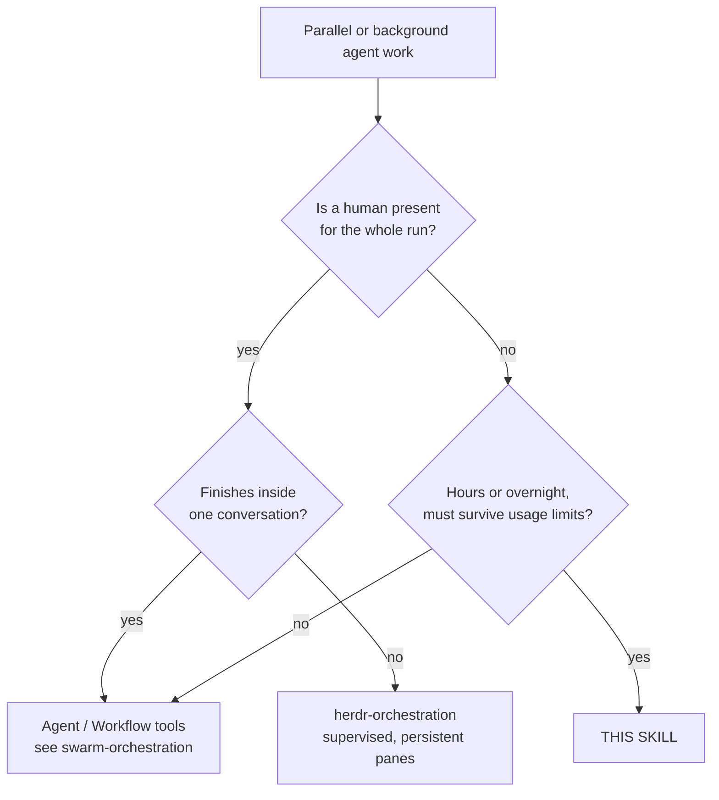
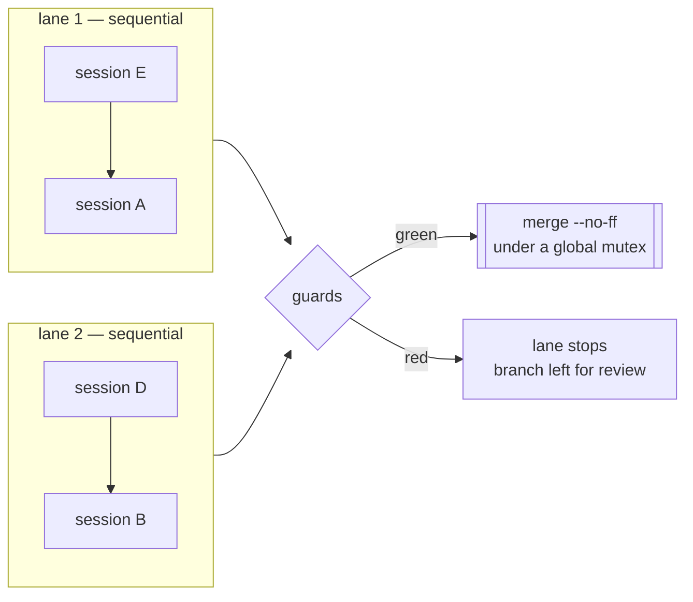

# Unattended Orchestration

Long-horizon agent work with **no human present**: an overnight batch, a weekend migration, a
queue of handoffs too large for one sitting. The runner starts each session, watches it, and
recovers it — through the usage limit, a 529, and a session that stops early.

Adopted from `basic-analysis`'s wave-3 runner (2026-09-04) and generalised; see
[ADR 0006](../../docs/decisions/0006-unattended-session-orchestration.md) for why it is config-driven.

## 0. Where each fact lives — read this before editing anything

This file is **normative policy**. It holds no paths, models, timeouts or test commands.

| Fact | Single owner |
|---|---|
| Sessions, models, briefs, lanes | your repo's `handoff.config.json` → `sessions`, `lanes` |
| Timeouts, retry and continue caps, poll interval | same file (defaults: `HandoffCore.psm1` → `$HandoffDefaults`) |
| Guard command and its paths | same file → `guards` |
| Tool allowlist, permission mode | same file → `allowedTools`, `permissionMode` |
| Branch, worktree and state locations | same file → `baseBranch`, `branchPrefix`, `worktree*`, `stateDir` |
| Shared brief preamble | same file → `briefTemplate` / `briefTemplateFile` |
| Every annotated field | [`handoff.config.example.json`](handoff.config.example.json) |
| Failure→recovery rules, config validation | [`HandoffCore.psm1`](HandoffCore.psm1) (tested) |
| Orchestration itself | [`run_handoff_sessions.ps1`](run_handoff_sessions.ps1) |

If you find a model name, a timeout or a test path in *this* file, that is a bug — replace it
with a pointer.

## 1. When this, and when something else



The distinction that matters is **who recovers a stopped session**. In-session tooling assumes
you are there; Herdr assumes you can look at a pane. This runner assumes nobody will look until
morning, so every stop must be classified and recovered automatically — or recorded in a state
file precisely enough to be understood cold.

**Do not use it** for work that fits in one sitting. The worktree, guard and merge machinery is
only worth its cost when the alternative is losing a night.

## 2. The model

**Lanes run in parallel; sessions inside a lane run in sequence.** That is the only scheduling
primitive, and it is enough: put sessions that contend for a resource — a database, a store, a
generated artifact — in the *same* lane, and independent ones in different lanes.

Each session gets its **own git worktree on its own branch**, cut from the current base branch.
Isolation is per *session*, not per subagent — see the worktree rules in
[`mcp-servers-setup`](../mcp-servers-setup/SKILL.md); a session per worktree is what gives each
one its own Serena process and its own graph.



Per session: create worktree → start background session with its brief → poll until the turn
ends → classify → recover or continue → run guards → merge. A red guard or a merge conflict
stops **that lane only**; other lanes keep running.

## 3. Recovery — the part that earns the skill

Every turn that ends is classified from the session log, and the kind decides the response:

| Kind | Response | Why |
|---|---|---|
| `auth` | **stop the lane immediately** | An expired login fails every launch instantly. Retrying burns the whole night for nothing. |
| `limit` | sleep until the reset epoch Claude reports, else a flat wait, then **resume the same session** | The message carries the exact reset time; waiting blind wastes hours. |
| `transient` | short wait, then resume | 500/529/network are self-clearing. |
| `other` + no DONE note | resume with a nudge, up to the continue cap | A session that stopped early has committed work; resuming continues from it. |
| permission prompt | **`blocked`**, lane stops | A background session cannot answer. It would sit there until morning. |

The exact patterns and waits live in `Classify-HandoffFailure`; they are covered by
[`tests/HandoffCore.Tests.ps1`](tests/HandoffCore.Tests.ps1), because the alternative way to
test them is to actually hit a usage limit at 03:00.

**Resume, never restart.** The runner keeps one live session per handoff: it stops the finished
one before resuming, so retries never accumulate background sessions holding the same
conversation. Nothing a session committed is ever lost.

## 4. Using it

```bash
# 1. copy and edit the annotated example
cp skills/unattended-orchestration/handoff.config.example.json .claude/handoff.config.json

# 2. validate BEFORE trusting it to a night — catches unknown sessions, bad lanes, missing paths
pwsh -File skills/unattended-orchestration/run_handoff_sessions.ps1 -Validate

# 3. dry run — creates nothing, launches nothing, exercises preflight and lane dispatch
pwsh -File skills/unattended-orchestration/run_handoff_sessions.ps1 -DryRun

# 4. the real thing
pwsh -File skills/unattended-orchestration/run_handoff_sessions.ps1
```

Useful flags: `-Sessions E` (one session, ignoring lanes), `-Fresh` (ignore recorded state),
`-NoMerge` (leave branches for review), `-WaitUntil "yyyy-MM-dd HH:mm"` (start later),
`-FollowUp "yyyy-MM-dd HH:mm" -FollowUpSessions E` (schedule a detached second run, so one
invocation covers a night *and* a morning).

Follow a running session: `claude attach <id>` joins it, `claude logs <id>` prints its output.
Both ids are recorded in `state.json` and the runner log.

## 5. Rules

1. **Validate before every unattended run.** `-Validate` then `-DryRun`. A lane naming a session
   that does not exist used to fail four hours in, inside a detached child whose stdout nobody
   was reading.
2. **Never put secrets in the config** — it is meant to be committed. Tokens are read from
   `envFrom` at preflight and exported to the children; they are never copied into a worktree.
3. **Guards are opt-in, and they gate the merge.** With no `guards` block the runner merges on a
   clean stop alone. Declare them for anything that touches shared state.
4. **A refusal is a signal, not an obstacle.** Sessions run under the auto-mode classifier. The
   brief must tell them to record a refusal in the DONE note and carry on — never to work around
   it. This is the single most important line in `briefTemplate`.
5. **Pre-approve the worktree** via `postWorktree`. A fresh worktree is an unapproved folder; the
   first session in it asks to trust the directory, and a background session cannot answer.
6. **Keep the machine awake.** The runner cannot change power settings.
7. **The tool allowlist must match how your MCP servers are wired.** A user-scope server is
   `mcp__<name>__*`; the same server as a plugin is `mcp__plugin_<plugin>_<server>__*`. Wrong
   prefix = the session silently lacks the tool. See
   [`mcp-servers-setup`](../mcp-servers-setup/SKILL.md).

## 6. Changing the runner

Tests are the contract, and both suites must stay green:

```bash
pwsh -File skills/unattended-orchestration/tests/HandoffCore.Tests.ps1   # pure logic
pwsh -File skills/unattended-orchestration/tests/Runner.Smoke.Tests.ps1  # the driver, via -Validate/-DryRun
```

Put anything that is a function of its arguments in `HandoffCore.psm1` so it can be tested
without an overnight run; the driver keeps only what genuinely touches git, `claude` or the
clock. Both bugs found on this runner's first real invocation lived in the driver and were
invisible to the unit tests — which is why the smoke suite invokes the script itself.

> **PowerShell array trap, twice over.** The output stream unrolls one array level. Both a
> `ForEach-Object` over nested arrays and an `if`/`else` **expression** assigned to a variable
> collapsed `[["E","A"]]` into `["E","A"]`, turning one sequential lane into two parallel ones —
> silently, and exactly against the contention lanes exist to prevent. Build nested arrays with
> an explicit loop and `+= ,`, and return them with a leading comma.
