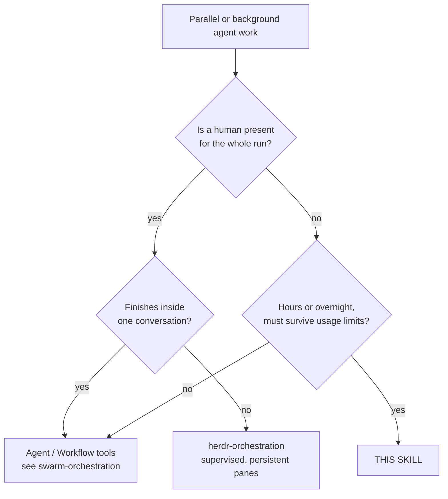
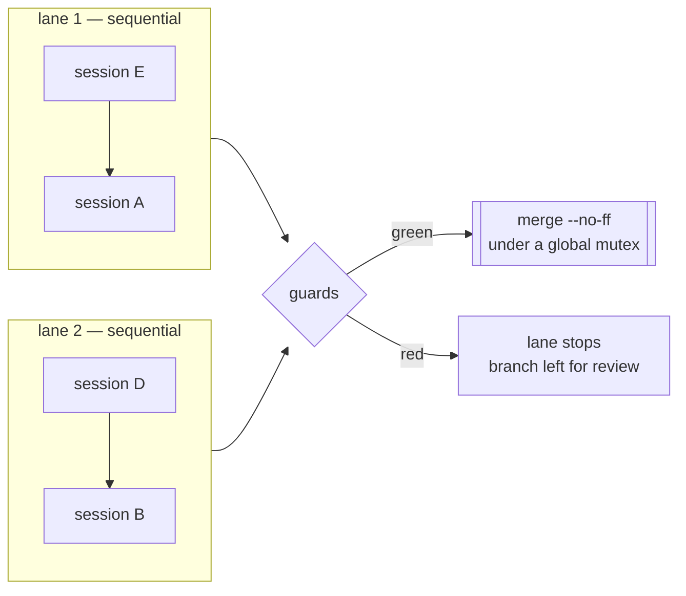
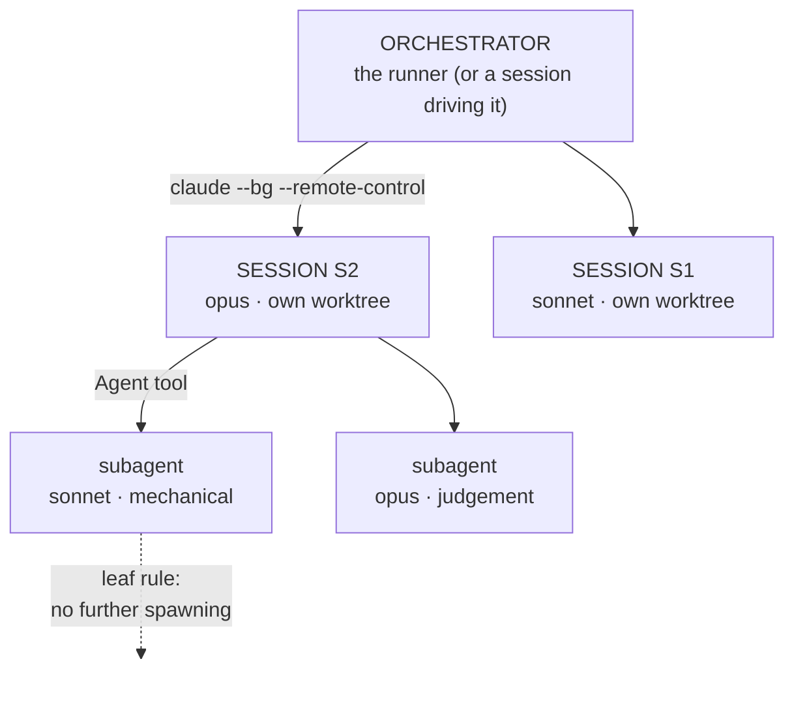

# Unattended Orchestration

Long-horizon agent work with **no human present**: an overnight batch, a weekend migration, a
queue of handoffs too large for one sitting. The runner starts each session, watches it, and
recovers it — through the usage limit, a 529, and a session that stops early.

Adopted from `basic-analysis`'s wave-3 runner (2026-09-04) and generalised; see
ADR 0006 in that repository for why it is config-driven.

## Adopting this skill in another repository

**Copy this folder in and run it. Nothing here is specific to the repo it came from.**

```bash
cp -r skills/unattended-orchestration <your-repo>/skills/     # or anywhere you like
cd <your-repo>
pwsh -File skills/unattended-orchestration/run_handoff_sessions.ps1 -Init
```

`-Init` writes `.claude/handoff.config.json`, detecting your git root and your **actual** base
branch. Then edit the sessions, and:

```bash
… -Validate      # repo, branch, lanes, guards, launcher — check before trusting it to a night
… -EmitBriefs    # read the briefs as markdown; launches nothing
… -DryRun        # rehearse preflight and lane dispatch; starts no session
…                # run it
```

Four properties make that work, and each is covered by
[`tests/Portability.Tests.ps1`](tests/Portability.Tests.ps1), which copies the skill into a
throwaway repository and drives the whole path there unedited:

| Property | Why it matters for adoption |
|---|---|
| **The repository is detected**, not configured (`git rev-parse --show-toplevel`) | A committed config carries no machine-specific path, so it works for everyone who clones it. `repo` remains available as an override. |
| **The session tool is an adapter** (`launcher`) | The default describes Claude Code, so an unedited config just runs. A repo driving a different agent replaces only the keys it needs — the block merges key-by-key, so overriding `command` does not silently lose `list`/`logs`/`stop`. |
| **Cross-platform primitives** | Junction on Windows, symlink elsewhere; named mutex on Windows, exclusive lock file elsewhere. A named `System.Threading.Mutex` throws `PlatformNotSupportedException` off Windows, which would kill the first state write. |
| **Guards, subagents and briefs are opt-in** | An unconfigured repo gets a runner that works, not one that assumes pytest, a venv, or a delegation policy. |

The one hard requirement is **PowerShell 7** (`pwsh`), which runs on Windows, Linux and macOS.

## 0. Where each fact lives — read this before editing anything

This file is **normative policy**. It holds no paths, models, timeouts or test commands.

| Fact | Single owner |
|---|---|
| Sessions, models, briefs, lanes | your repo's `handoff.config.json` → `sessions`, `lanes` |
| Subagent tiers, concurrency cap, leaf rule | same file → `subagents` |
| Timeouts, retry and continue caps, poll interval | same file (defaults: `HandoffCore.psm1` → `$HandoffDefaults`) |
| Guard command and its paths | same file → `guards` |
| Tool allowlist, permission mode | same file → `allowedTools`, `permissionMode` |
| Which agent to drive, and how | same file → `launcher` (defaults to Claude Code) |
| Branch, worktree and state locations | same file → `baseBranch`, `branchPrefix`, `worktree*`, `stateDir` |
| Shared brief preamble | same file → `briefTemplate` / `briefTemplateFile` |
| Every annotated field | [`handoff.config.example.json`](handoff.config.example.json) |
| Failure→recovery rules, config validation | [`HandoffCore.psm1`](HandoffCore.psm1) (tested) |
| Orchestration itself | [`run_handoff_sessions.ps1`](run_handoff_sessions.ps1) |

If you find a model name, a timeout or a test path in *this* file, that is a bug — replace it
with a pointer.

## 1. When this, and when something else



The distinction that matters is **who recovers a stopped session**. In-session tooling assumes
you are there; Herdr assumes you can look at a pane. This runner assumes nobody will look until
morning, so every stop must be classified and recovered automatically — or recorded in a state
file precisely enough to be understood cold.

**Do not use it** for work that fits in one sitting. The worktree, guard and merge machinery is
only worth its cost when the alternative is losing a night.

## 2. The model

**Lanes run in parallel; sessions inside a lane run in sequence.** That is the only scheduling
primitive, and it is enough: put sessions that contend for a resource — a database, a store, a
generated artifact — in the *same* lane, and independent ones in different lanes.

Each session gets its **own git worktree on its own branch**, cut from the current base branch.
Isolation is per *session*, not per subagent — see the worktree rules in
the `mcp-servers-setup` skill; a session per worktree is what gives each
one its own Serena process and its own graph.



Per session: create worktree → start background session with its brief → poll until the turn
ends → classify → recover or continue → run guards → merge. A red guard or a merge conflict
stops **that lane only**; other lanes keep running.

## 3. Recovery — the part that earns the skill

Every turn that ends is classified from the session log, and the kind decides the response:

| Kind | Response | Why |
|---|---|---|
| `auth` | **stop the lane immediately** | An expired login fails every launch instantly. Retrying burns the whole night for nothing. |
| `limit` | sleep until the reset epoch Claude reports, else a flat wait, then **resume the same session** | The message carries the exact reset time; waiting blind wastes hours. |
| `transient` | short wait, then resume | 500/529/network are self-clearing. |
| `other` + no DONE note | resume with a nudge, up to the continue cap | A session that stopped early has committed work; resuming continues from it. |
| permission prompt | **`blocked`**, lane stops | A background session cannot answer. It would sit there until morning. |

The exact patterns and waits live in `Classify-HandoffFailure`; they are covered by
[`tests/HandoffCore.Tests.ps1`](tests/HandoffCore.Tests.ps1), because the alternative way to
test them is to actually hit a usage limit at 03:00.

**Resume, never restart.** The runner keeps one live session per handoff: it stops the finished
one before resuming, so retries never accumulate background sessions holding the same
conversation. Nothing a session committed is ever lost.

## 4. Three layers of orchestration

An unattended run is three levels deep, and each level has a different job. Collapsing them —
one giant session doing everything itself — is the failure this section exists to prevent.



| Layer | Owns | Never does |
|---|---|---|
| **Orchestrator** | worktrees, launch, recovery, guards, merge | the work itself |
| **Session** | one handoff, start to DONE note; delegates to subagents | merge to the base branch |
| **Subagent** | one scoped task with an explicit return contract | spawn further subagents (*leaf rule*) |

**Sessions stay joinable.** Each launches with a stable `--remote-control` name, so an
"unattended" run is interactive on demand — `claude attach handoff-S2` joins it and lets you
type; `claude logs handoff-S2` reads its output without joining. That name is derived in
`Get-HandoffSessionVars` and printed in the runner log, the state file, and every emitted brief.

**Subagent policy is stated once.** The `subagents` block renders into every brief as
`{{subagentPolicy}}`, so all sessions delegate the same way. It is opt-in: a session told to
delegate with no cap and no tier assignment delegates badly. The leaf rule mirrors
the `swarm-orchestration` skill - without it a wave fans out
geometrically and the budget is gone before the work is.

## 5. Choosing a model per session

Route by the **shape** of the work, not its importance. The question that decides the tier is
whether a wrong answer is *visible*: mechanical work fails loudly and cheaply, judgement work
fails quietly and is discovered much later.

| Work shape | Tier | Why |
|---|---|---|
| Pattern-matching an established convention; closed-file edits; scaffolding; renames; doc sweeps | cheaper tier | Structurally verifiable. A guard or a diff catches it immediately. |
| Config with repo-wide blast radius; anything where the recovery is "revert and re-verify" | top tier | Needs the discipline to verify through the real path and back out rather than push through. |
| Deciding what survives a refactor; reconciling two designs; ambiguous requirements | top tier | Fails silently. Nothing goes red when judgement is wrong. |
| Work whose output another session depends on | top tier | Its errors are inherited, not contained. |

Put the chosen model in each session's `model`, and the subagent tiers in `subagents.tiers`.
Neither belongs in this file.

## 6. Flags beyond the adoption path

The four-step path is in *Adopting this skill* above. Beyond it:

| Flag | Effect |
|---|---|
| `-Sessions X,Y` | run just these, as one sequential lane, ignoring configured lanes |
| `-Lanes "X,Y" "Z"` | override the configured lanes for this run |
| `-Fresh` | ignore recorded state; re-run sessions already marked merged |
| `-NoMerge` | stop after the guards; leave branches for review |
| `-WaitUntil "yyyy-MM-dd HH:mm"` | sleep, then start |
| `-FollowUp "…" -FollowUpSessions X` | also schedule a detached second run, so one invocation covers a night *and* a morning |
| `-OutFile <path>` | with `-EmitBriefs`, write instead of printing |
| `-Init -Force` | overwrite an existing config |

**`-EmitBriefs` is the manual path.** It renders each session as a `### Session` block — model,
branch, worktree, attach command, then the brief in a fenced block — and launches nothing, so one
config serves both an unattended run and a human pasting into interactive sessions. Both call the
same `Build-HandoffBrief`, so pasted text cannot drift from what would have launched; that is the
whole point, and it makes the emitted markdown **generated** — edit the config and re-emit, never
the file. Use it for a session whose blast radius wants a human watching.

Follow a running session with the launcher's own commands (`claude attach <id>`,
`claude logs <id>` by default). Both ids are recorded in `state.json` and the runner log.

## 7. Rules

1. **Validate before every unattended run.** `-Validate` then `-DryRun`. A lane naming a session
   that does not exist used to fail four hours in, inside a detached child whose stdout nobody
   was reading.
2. **Never put secrets in the config** — it is meant to be committed. Tokens are read from
   `envFrom` at preflight and exported to the children; they are never copied into a worktree.
3. **Guards are opt-in, and they gate the merge.** With no `guards` block the runner merges on a
   clean stop alone. Declare them for anything that touches shared state.
4. **A refusal is a signal, not an obstacle.** Sessions run under the auto-mode classifier. The
   brief must tell them to record a refusal in the DONE note and carry on — never to work around
   it. This is the single most important line in `briefTemplate`.
5. **Pre-approve the worktree** via `postWorktree`. A fresh worktree is an unapproved folder; the
   first session in it asks to trust the directory, and a background session cannot answer.
6. **Keep the machine awake.** The runner cannot change power settings.
7. **The tool allowlist must match how your MCP servers are wired.** A user-scope server is
   `mcp__<name>__*`; the same server as a plugin is `mcp__plugin_<plugin>_<server>__*`. Wrong
   prefix = the session silently lacks the tool. See
   `mcp-servers-setup`.

## 8. Changing the runner

Tests are the contract, and both suites must stay green:

```bash
pwsh -File skills/unattended-orchestration/tests/HandoffCore.Tests.ps1   # pure logic
pwsh -File skills/unattended-orchestration/tests/Runner.Smoke.Tests.ps1  # the driver, via -Validate/-DryRun
```

Put anything that is a function of its arguments in `HandoffCore.psm1` so it can be tested
without an overnight run; the driver keeps only what genuinely touches git, `claude` or the
clock. Both bugs found on this runner's first real invocation lived in the driver and were
invisible to the unit tests — which is why the smoke suite invokes the script itself.

> **PowerShell array trap, twice over.** The output stream unrolls one array level. Both a
> `ForEach-Object` over nested arrays and an `if`/`else` **expression** assigned to a variable
> collapsed `[["E","A"]]` into `["E","A"]`, turning one sequential lane into two parallel ones —
> silently, and exactly against the contention lanes exist to prevent. Build nested arrays with
> an explicit loop and `+= ,`, and return them with a leading comma.
